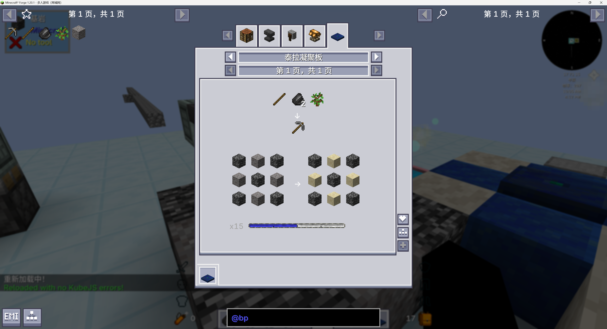
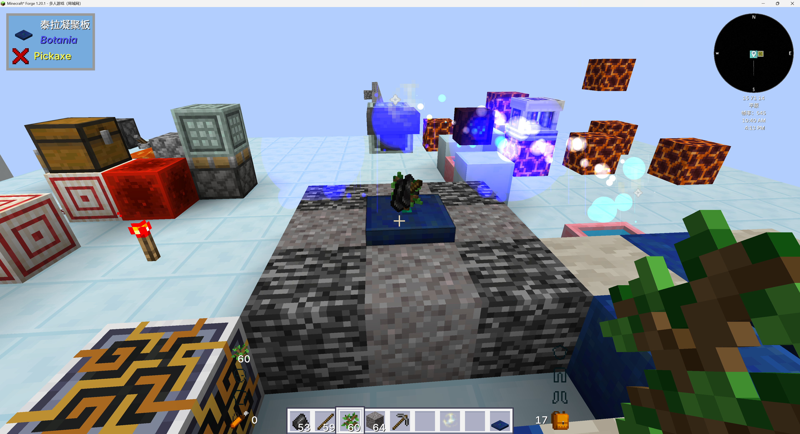

# KubeJS-Botania
 KubeJS support for botania

通过原KubeJS-Botania模组改编
https://github.com/Prunoideae/KubeJS-Botania/tree/1.20.1?tab=readme-ov-file
支持泰拉凝聚板多方块合成



kubejs示例

```
// 石镐
event.recipes.botania.terra_plate({
results: [
{ item: 'minecraft:stone_pickaxe' }
],
ingredients: [
{ item: 'minecraft:stick' },
{ item: 'minecraft:flint', count: 2 },
{ item: 'minecraft:oak_sapling' }
],
mana: 15500000,
center: 'minecraft:bedrock',
edge: 'minecraft:gravel',
corner: 'minecraft:bedrock',
centerReplace: 'minecraft:bedrock', 
edgeReplace: 'minecraft:sand', 
cornerReplace: 'minecraft:bedrock'
});
```

记得将原版的配方删除
我没做原版配方删除 
好像删了又好像没删完

```
event.remove({
output: 'botania:terrasteel_ingot'
})
```